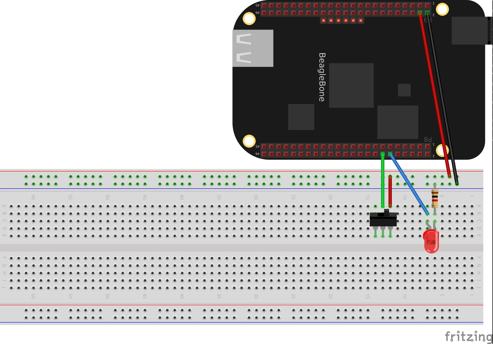
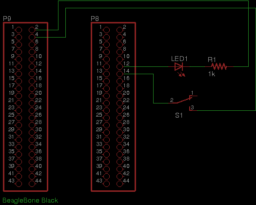

# M2X Nerves Test

A test of sending data to M2X using a BeagleBone Black running Elixir and Nerves.

## Prerequisites

* [BeagleBone Black](https://beagleboard.org/black)
* [Nerves](https://hexdocs.pm/nerves/installation.html)
* [Elixir](https://elixir-lang.org/install.html)
* [M2X Account](https://m2x.att.com/) (free)
* Micro SD card
* Components: Switch, LED, 1k resistor, jumper wires, breadboard

## Pinouts

```text
DGND     (P9-2)
VDD_3.3V (P9-4)
GPIO_26  (P8-14): Switch
GPIO_44  (P8-12): LED (w/ 1k current limiting resistor)
```




## Configuration

* Copy `config/dev.sample.exs` to `config/dev.exs`.
* Create an [M2X](https://m2x.att.com) device using the M2X UI.
* In the M2X UI, create a `numeric` stream named `switch_1`.
* Copy the M2X device ID and API key to `config/dev.exs`.

## Compiling

Set the target hardware to the BeagleBone Black. This only needs to be done once
for a given shell session.

```text
export MIX_TARGET=bbb
```

Fetch the project dependencies:

```text
mix deps.get
```

Compile the firmware:

```text
mix firmware
```

Burn the firmware to an SD card:

```text
mix firmware.burn
```

Insert the card into the BeagleBone Black, power up the board, and monitor the
console. If it boots to the onboard flash instead of the SD card, hold down the
user button (S2) while rebooting.

## Running

Closing the switch (`GPIO_26`) will send a value of `1` to M2X. Opening the
switch will send a value of `0`. This will be shown on the M2X stream graph/log.

Run `bin/set_led` to send an M2X command to turn the LED on(`1`)/off(`0`). The
API key must be an account **master** API key.

```text
API_KEY=ABCDE DEVICE_ID=12345 set_led 1
```
